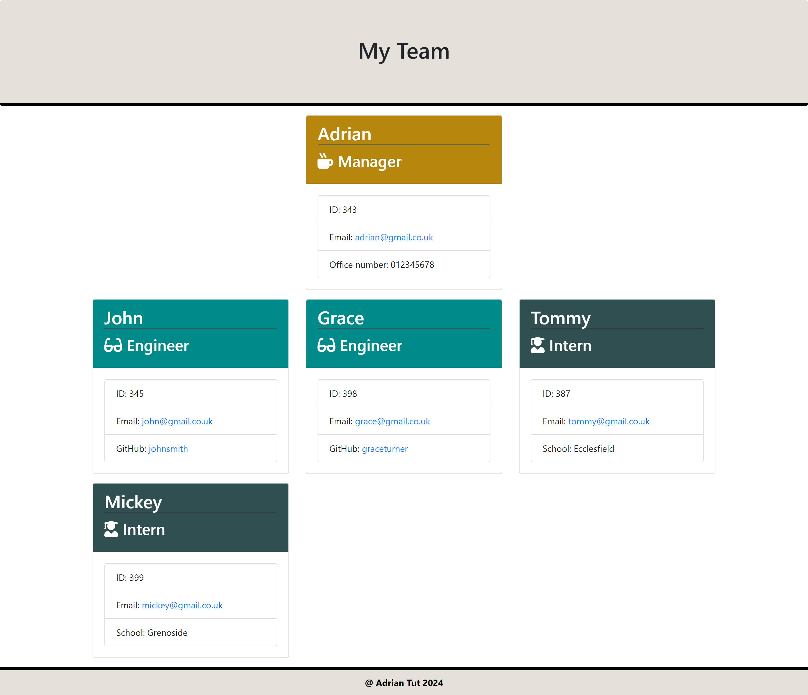

# Team Profile Generator App

## Description

This command-line application generates HTML files based on input provided via a user interface. It is designed to help managers quickly generate a webpage displaying basic information about their team members, including their names, IDs, email addresses, and additional details such as GitHub usernames or schools for engineers and interns respectively.

### Key Features

1.User-friendly Interface: The application provides a straightforward command-line interface that guides users through the process of inputting information about their team members.

2.Class Structure: It employs an object-oriented approach with a well-defined class structure, including parent and subclass relationships. This ensures clarity and maintainability of the codebase.

3.Dynamic HTML Generation: The application dynamically generates an HTML webpage based on the input provided by the user. This allows managers to quickly create a visually appealing and informative summary of their team members.

4.Testing: The project includes a comprehensive suite of unit tests using Jest, ensuring that each component of the application functions correctly and reliably.

Here is the GitHub repository: https://github.com/Adriantutuianu/team-profile-generator-app-challenge

## Mock-Up

For a visual representation of the generated HTML's appearance and functionality, refer to the provided mock-up.

### 

## Installation

Clone the repository:

```bash
git clone https://github.com/Adriantutuianu/team-profile-generator-app-challenge
```

Navigate to Project Directory:

```bash
cd team-profile-generator-app-challenge
```

Install Dependencies:

```bash
npm install
```

## Usage

```bash
node index.js
```

Follow Prompts:
Answer the prompts to provide information about your staff.

HTML Generated:
Once all prompts are complete, the application will dynamically generate a team.html inside the folder /output in the project root.

## Credits

### Project Contributors

- [Adrian Tutuianu GitHub Profile](https://github.com/Adriantutuianu)

### Special Thanks

- [Edx Front end Web Bootcamp](https://www.edx.org/boot-camps)

## License

This project is licensed under the [MIT License](https://en.wikipedia.org/wiki/MIT_License).
